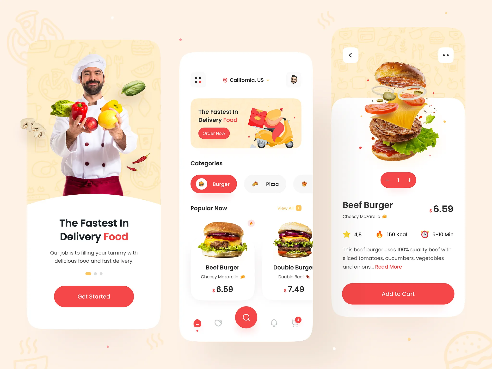
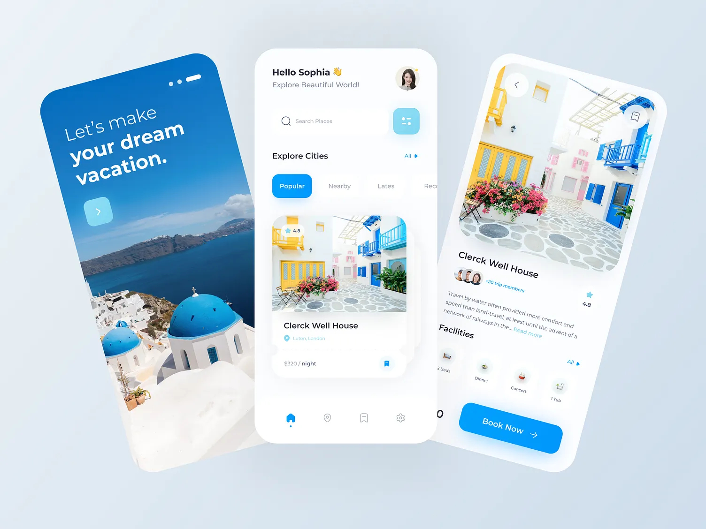

# Flutter Tutorial
The source code from my various YouTube videos includes Flutter UI designs, AI integrations in Flutter, and using local databases in Flutter apps.

Flutter UI Design: https://www.youtube.com/playlist?list=PLOEXB48nQMqPHPN79sya9t2q1GX6SiNtU  
AI Integration: https://www.youtube.com/playlist?list=PLOEXB48nQMqO9VihhfJwiB-GEitKGNOkb  
Hive Database: https://www.youtube.com/playlist?list=PLOEXB48nQMqNBvcG_nTb18XblsiLzxvMW

Some of the Dribbble UI designs have also been recreated in Flutter as part of these projects.

## Football Live Score App UI 

  

## Medical App

  

## Food Delivery App 🍔

  
 

## Travel App

  
 

## And many more other tutorial, visit the YouTube playlist for all.